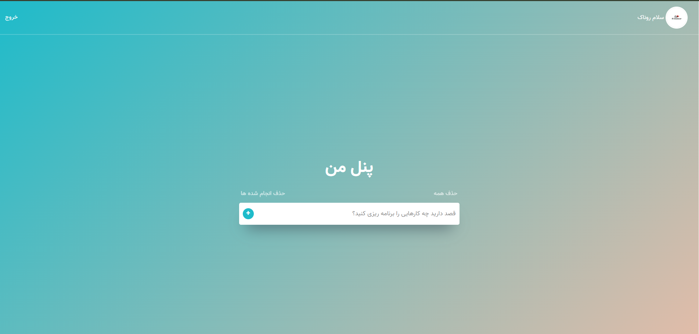

# 📝 Django To-Do Panel

A simple and elegant **To-Do List Web Application** built with **Django**.  
This project helps users to **manage their tasks** efficiently by adding, deleting, and marking them as complete.

---

## 🚀 Features:
- ✅ **User Authentication** (Login/Register)
- ✅ **CRUD Operations**:
  - Add a task
  - Delete a task
  - Mark a task as completed
- ✅ **Delete All Tasks or Completed Tasks**
- ✅ **Profile Page with Avatar Upload**
- ✅ **Change Password from Profile**
- ✅ **Fully Responsive UI**
- ✅ **Persian (Farsi) Support for Right-to-Left Layout**

---

## 🔧 Installation & Setup

### 1️⃣ Clone the Repository:
```sh
git clone https://github.com/hossein-sa/django-todo-app.git
cd django-todo-app
```

### 2️⃣ Create & Activate Virtual Environment:
```sh
python -m venv venv
source venv/bin/activate    # For macOS/Linux
venv\Scripts\activate       # For Windows
```

### 3️⃣ Install Dependencies:
```sh
pip install -r requirements.txt
```

### 4️⃣ Apply Migrations:
```sh
python manage.py migrate
```

### 5️⃣ Create Superuser (for Admin Panel):
```sh
python manage.py createsuperuser
```

### 6️⃣ Run the Development Server:
```sh
python manage.py runserver
```

Now visit **`http://127.0.0.1:8000/`** in your browser.

---

## 📂 Project Structure:
```
📦 django-todo-panel
 ┣ 📂 accounts
 ┃ ┣ 📜 models.py
 ┃ ┣ 📜 views.py
 ┃ ┣ 📜 urls.py
 ┃ ┣ 📜 forms.py
 ┣ 📂 todo
 ┃ ┣ 📜 models.py
 ┃ ┣ 📜 views.py
 ┃ ┣ 📜 urls.py
 ┃ ┣ 📜 forms.py
 ┣ 📂 static
 ┃ ┣ 📂 css
 ┃ ┣ 📂 images
 ┣ 📂 templates
 ┃ ┣ 📜 base.html
 ┃ ┣ 📜 index.html
 ┃ ┣ 📜 login.html
 ┃ ┣ 📜 register.html
 ┃ ┣ 📜 profile.html
 ┣ 📜 manage.py
 ┣ 📜 requirements.txt
 ┣ 📜 README.md
```

---

## 📸 Screenshots

### 📌 Dashboard


### 📌 Login Page


### 📌 Profile Page


---

## 🌍 Technologies Used:
- **Django** (Python Framework)
- **HTML, CSS** (Frontend)
- **Bootstrap** (Styling)
- **SQLite** (Database)

---

## 🤝 Contributing:
If you want to contribute, follow these steps:
1. Fork the repository 🍴
2. Create a new branch (`git checkout -b feature-name`)
3. Make your changes and commit (`git commit -m "Added new feature"`)
4. Push to your fork (`git push origin feature-name`)
5. Open a Pull Request (PR) 🚀

---

## 📄 License:
This project is **open-source** and available under the **MIT License**.

---
**💡 Made with ❤️ by Hossein Sadeghi**
